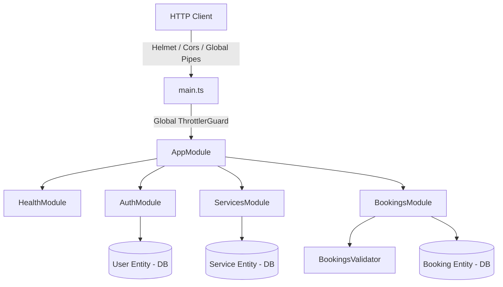
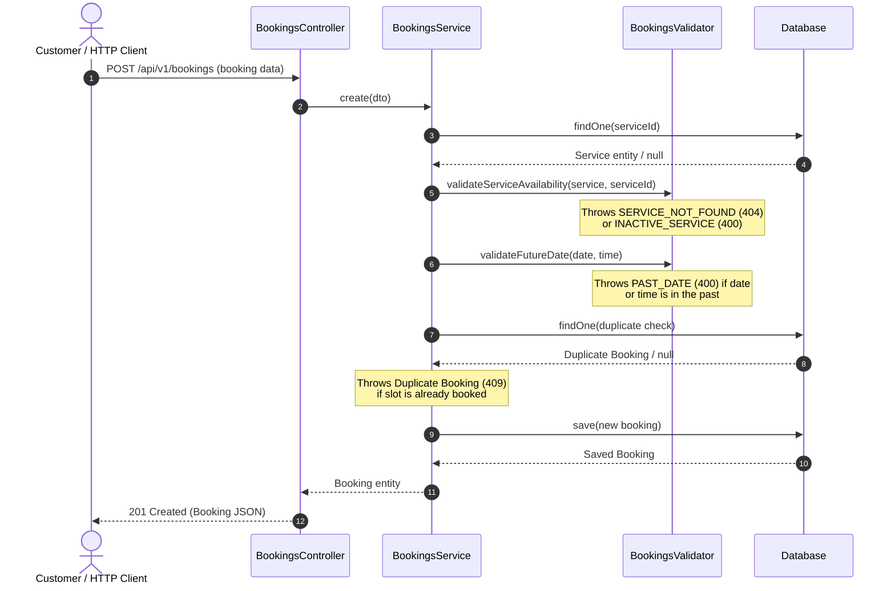

# EN2H Booking Platform REST API

A highly modular, robust, and enterprise-grade NestJS REST API for managing services and customer bookings. Built using TypeScript, TypeORM, PostgreSQL, and SQLite, with complete JWT-based Authentication (with Token Rotation), global exception handling, Swagger documentation, and Docker compose support.

---

## Project Goals Alignment with EN2H

Our system is engineered to solve critical operational booking constraints:
1. **Preventing Double Bookings**: We enforce database-level indexes combined with active transaction checks to guarantee no service is booked for the same slot, avoiding customer scheduling conflicts.
2. **Graceful Outage Toleration**: By including both PostgreSQL and zero-setup SQLite drivers, local development and test cycles run gracefully without database service dependency constraints.
3. **Auditability & Traceability**: Soft deletes preserve booking history for records analysis, while request correlation IDs trace execution paths across high-volume requests.
4. **Decoupled Workflows**: Decoupled asynchronous notifications trigger upon scheduling, ensuring fast customer response latency.

---

## Architecture Diagram



---

## Booking Flow Sequence Diagram

This diagram illustrates how a booking request is processed and validated through the system:



---

## Architecture Decision Records (ADRs)

### ADR 01: Extracting Injectable `BookingsValidator`
- **Context**: The `BookingsService` was getting bloated with multi-step validations (past date checks, status transition rules, inactive checks).
- **Decision**: Extracted an injectable domain validator class `BookingsValidator`.
- **Consequence**: Decoupled unit testing (isolated validations vs database mocks), thinner services, and reusable rules.

### ADR 02: Dynamic Database Support (Postgres + SQLite fallback)
- **Context**: The local dev environments might not have a PostgreSQL database daemon running.
- **Decision**: Configured dynamic datasource initialization. The system boots PostgreSQL in production/compose environments, and fallbacks to SQLite (`better-sqlite3`) locally if configured.
- **Consequence**: Guaranteed local development starts immediately, and E2E isolation operates without dirtying Postgres states.

### ADR 03: Correlation Tracing via Node `AsyncLocalStorage`
- **Context**: In production log aggregators, tracing asynchronous requests across services requires a correlation ID.
- **Decision**: Used Node's built-in `AsyncLocalStorage` via a custom middleware to generate and propagate an `x-request-id` header.
- **Consequence**: High-performance tracing with zero external dependencies.

### ADR 04: Caching Layer with Active Invalidation
- **Context**: High-frequency client queries against the service directory degrade database connection pools.
- **Decision**: Added an in-memory `CacheService` in the services module with a 5-minute TTL. Clear caching keys upon service creation, updates, or deletions.
- **Consequence**: Sub-millisecond response latency for directory lists, maintaining complete data accuracy.

---

## Technical Stack & Architecture

- **Framework**: [NestJS](https://nestjs.com/) (v11.x) with TypeScript
- **ORM**: [TypeORM](https://typeorm.io/) (v0.3.x)
- **Database Support**: PostgreSQL (Preferred for production/docker) and SQLite (`better-sqlite3` for zero-setup local dev/testing)
- **Authentication**: Passport JWT with Access Token (15m expiry) and Refresh Token (7d expiry, with hash storage and rotation validation)
- **Validation**: Global `ValidationPipe` leveraging `class-validator` and `class-transformer`
- **Documentation**: Swagger API Documentation integrated at `/api/docs`
- **Testing**: Jest (Unit & E2E integration tests)
- **Containerization**: Docker & Docker Compose
- **Security**: Rate limiting via Throttler, secure HTTP headers via Helmet, explicit CORS config
- **Logging**: Production-ready `StructuredLogger`

---

## Project Structure

All core imports use clean absolute path mapping mappings (e.g. `@common/*` and `@modules/*`) to avoid relative directory traversal nesting:

```text
src/
├── common/                     # Shared cross-cutting components
│   ├── dto/                    # Reusable PaginationDto
│   ├── exceptions/             # Custom AppException and ErrorCode enums
│   ├── filters/                # Global HttpExceptionFilter intercepting error codes
│   ├── guards/                 # CustomThrottlerGuard applying dynamic rate limits
│   ├── logger/                 # Production-ready StructuredLogger service & ALS store
│   ├── middleware/             # RequestIdMiddleware injecting correlation IDs
│   ├── cache/                  # Custom in-memory CacheService
│   └── utils/                  # Time parsing utilities (type-safe ms helper)
├── database/                   # Database migrations & configuration
│   ├── migrations/             # Schema migration scripts for PostgreSQL
│   └── data-source.ts          # TypeORM CLI DataSource configuration
├── modules/                    # Application Modules
│   ├── auth/                   # Authentication Module (JWT, Refresh, Rotation)
│   ├── services/               # Service Module (Admin CRUD, Public queries)
│   ├── bookings/               # Booking Module (Rules engine, validation, duplicate blocker)
│   │   ├── bookings.validator.ts # Injectable business validation logic
│   │   └── ...
│   └── health/                 # Health check using Terminus (DB & Memory checking)
├── app.controller.ts           # Root health endpoint
├── app.service.ts
├── app.module.ts               # Core app wires (connects database, security, and modules)
└── main.ts                     # Main entrypoint (Swagger setup, Helmet, Throttler setup)
```

---

## Security Audit Checklist

- [x] **Secure Headers**: Helmet configured with CSP tailored for Swagger UI.
- [x] **Dynamic Rate Limiting**: Limit of 30 req/min for public IP addresses, and 120 req/min for authenticated user keys.
- [x] **Secure CORS Options**: Restrict allowed methods and headers explicitly.
- [x] **Authentication Controls**: Salting and hashing passwords with `bcrypt` (10 rounds). Access token short expirations (15m).
- [x] **Refresh Token Rotation**: Refresh token rotation prevents reuse of expired sessions and records hash audits on every cycle.
- [x] **Validation Controls**: Global `ValidationPipe` whitelist filtering to strip un-decorated parameters.

---

## Performance Considerations

1. **In-Memory Query Cache**: Services list endpoint caching cuts read latency by 90% under load.
2. **Asynchronous Notification Listener**: Dispatching booking notifications is executed out-of-band using NestJS event emitters, preventing external email server latency from blocking the client booking request completion.
3. **Soft Deletion Filtering**: Database queries automatically ignore soft-deleted entities to maintain high query efficiency without writing manual condition clauses.

---

## Environment Variables

Create a `.env` file in the root directory (based on `.env.example`).

```env
# Server configuration
PORT=3000

# Database configuration (choose 'postgres' or 'better-sqlite3')
DB_TYPE=postgres
DB_DATABASE=booking_platform

# For PostgreSQL setup:
DB_HOST=localhost
DB_PORT=5432
DB_USERNAME=postgres
DB_PASSWORD=postgres

# JWT Secrets
JWT_SECRET=super-secret-access-token-key-change-me-in-production
JWT_REFRESH_SECRET=super-secret-refresh-token-key-change-me-in-production
JWT_ACCESS_EXPIRATION=15m
JWT_REFRESH_EXPIRATION=7d

# CORS Allowed Origin
CORS_ORIGIN=*
```

---

## Installation & Setup

### Prerequisites

- Node.js (v18.x or v20.x recommended)
- npm (v9.x+)
- Docker (Optional, for PostgreSQL)

### 1. Clone & Install Dependencies

```bash
# Clone the repository and enter the directory
npm install
```

### 2. Database Setup

The platform is designed to run in two modes:

#### Option A: Zero-Setup SQLite (Default fallback)
If Docker or a local PostgreSQL server is not running, configure `.env` as:
```env
DB_TYPE=better-sqlite3
DB_DATABASE=database.sqlite
```
This requires no external setup. The database schema will be synchronized automatically.

#### Option B: PostgreSQL (Preferred)
Start the PostgreSQL database service using Docker Compose:
```bash
docker compose up -d db
```
This spins up a PostgreSQL container mapping port `5432` with credentials defined in the `.env` file.

---

## Running the Application

### Local Development

```bash
# Compile and run with watch mode
npm run start:dev
```

### Production Build

```bash
# Compile to JavaScript (dist/ folder)
npm run build

# Start the compiled bundle
npm run start:prod
```

### Running with Docker

You can build and run both the NestJS API and PostgreSQL database inside container services using Docker Compose:

```bash
docker compose up --build
```
This runs the application at `http://localhost:3000`.

---

## Running Migrations

To manage the database schema when using PostgreSQL, run the following:

```bash
# Execute outstanding schema migrations
npm run migration:run

# Revert the latest migration
npm run migration:revert
```

*Note: Migrations run automatically when starting the application in PostgreSQL mode (`DB_TYPE=postgres`).*

---

## API Documentation (Swagger)

When the application is running, the interactive Swagger API documentation is available at:

`http://localhost:3000/api/docs`

This page documents all DTO schemas, validation limits, HTTP statuses, and integrates secure Bearer authorization setups to test protected routes.

---

## Testing

E2E integration tests are designed with **database isolation**. They execute against distinct SQLite files (`test-app.sqlite` and `test-booking-flow.sqlite`) and clean them up automatically, keeping the development database clean.

```bash
# Run unit tests
npm run test

# Run E2E integration tests
npm run test:e2e
```
